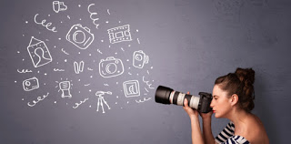

# INTRODUCCIÓN AL MUNDO DE LA FOTOGRAFÍA

## INTRODUCCIÓN AL MUNDO DE LA FOTOGRAFÍA

**Fotografía**: Es el arte de producir imágenes por acción de la luz.

La palabra, “Fotografía” tal y como la conocemos ahora, la utilizó por primera instancia en 1839 Sir John Herschel. En ese mismo año se publicó todo el proceso fotográfico. La palabra se deriva del griego foto igual a; \(luz\) y grafos de escritura.

El termino _cámara_ deriva de camera, que en latín significa habitación' o cámara’. La cámara oscura original era una habitación cuya única fuente de luz era un minúsculo orificio en una de las paredes. La luz que penetraba por aquel orificio proyectaba una imagen del exterior en la pared opuesta. Aunque la imagen así formada resultaba invertida y borrosa. Con el transcurso de los siglos la cámara oscura evolucionó y se convirtió en una pequeña caja manejable, y al orificio se le instaló una lente óptica para conseguir una imagen más clara y definida.

Los avances de la fotografía a lo largo del siglo XX se centran en el desarrollo de su aplicación al mundo de la información y de la ciencia. Las fotografías en color se tomaban con cámaras de tres exposiciones. Con la aparición de la película en color Kodachrome en 1935 y la de Agfacolor en 1936, se generalizó el uso de la película en color.

La nueva técnica llamada fotopolimerización hizo posible la producción de copias por contacto sobre papel normal no sensibilizado.

Con la introducción de la película y la cámara portátil, se puso al alcance del público en general.

### EL NACIMIENTO DE LA FOTOGRAFÍA

Luis Jaime Daguerre fue quien inventó las pinturas llamadas _dioramas_, que iluminadas unas veces sólo por delante y otras por detrás cambiaban los efectos de luz haciendo desaparecer unas figuras para aparecer otras.

Durante mucho tiempo Niepce y Daguerre no podían descubrir sus investigaciones mutuamente, hasta que en 1829, Niepce firma un convenio para trabajar en común. Luego Daguerre viaja a Paris, conservando su relación con Niepce y mejor que éste, obtiene unos resultados; comprueba que una placa de plata expuesta a la acción de los vapores de yodo se cubre de una superficie sensible de yoduro de plata que se impresiona por la acción de la luz. La alteración producida apenas es visible, pero puede revelarse sometiéndola a la acción de los vapores de mercurio, y la imagen puede luego fijarse disolviendo en cianuro de potasio el exceso de yoduro de plata inalterado.

Niepce no llegó a ver el resultado de los trabajos de Daguerre, pues murió en julio de 1833, muy poco antes de haber obtenido aquél las pruebas definitivas. Isidoro, hijo de Niepce, sucedió a su padre en la compañía formada con Daguerre, con el cual trató de encontrar recursos económicos para la explotación del invento. Fracasados en este propósito, intentaron formar una sociedad por acciones de 100 francos cada una, pero tampoco fueron afortunados

### FOTOGRAFÍA COMERCIAL Y PUBLICITARIA

La fotografía se ha utilizado para inspirar e influir opiniones políticas o sociales. Desde la década de 1920 se ha hecho uso de ella para impulsar y dirigir el consumo, y como un componente más de la publicidad. Los fotógrafos, con el fin de que sus imágenes resulten atractivas utilizan una amplia gama de sofisticadas técnicas. La fotografía comercial y publicitaria ha representado también un gran impulso en la industria gráfica junto con los avances en las técnicas de reproducción fotográfica de gran calidad.

En el siglo XX, la fotografía comercial creció con rapidez y las mejoras del blanco y negro abrieron camino a todos aquellos que carecían del tiempo y la habilidad para los tan complicados procedimientos del siglo anterior.

### REPORTAJE FOTOGRÁFICO

Toda la fotografía es, un reportaje. Los primeros investigadores se limitaron a registrar lo que veían, pero en 1960 se dividieron: los que seguían utilizando su cámara para captar imágenes sin ninguna intención y los que decidieron que la fotografía era una nueva forma de arte visual. La fotografía combina el uso de la imagen como documento y como testimonio; subgénero que se conoce con el nombre de fotografía social.

#### **6.1 Fotografía Documental**

Roger Fenton consiguió las primeras fotografías que mostraron con crudeza la guerra de Crimen al público británico. Mathew Brady, Alexander Gardner y Timothy O'Sullivan documentaron la triste realidad de la guerra de la Secesión. Luego, Gardner y O'Sullivan fotografiaron el Oeste de Estados Unidos con Watkins, Muybridge, Jackson y Curtis. Las claras y detalladas fotos de estos artistas mostraron una imagen imborrable de la naturaleza salvaje.

Con la creación de la plancha negativa seca por Bennett en 1878, el trabajo de los fotógrafos viajeros fue mucho menos arduo. En lugar de tener que revelar la plancha en el momento, aún húmeda, el fotógrafo podía guardarla y revelarla más tarde en cualquier otro lugar.

#### **6.2 Documentación Social**

Algunos fotógrafos se limitaron a documentar las condiciones de su propio entorno.

#### **6.3 Periodismo Gráfico**

El Periodismo Gráfico difiere de cualquier otra tarea fotográfica documental en que su propósito es contar una historia concreta en términos visuales.

### FOTOGRAFÍA ARTÍSTICA

El daguerrotipo positivo, sostenía que la dinámica de cualquier situación dada alcanza en algún momento su punto álgido, instante que se corresponde con la imagen más significativa. Muchas de las imágenes tienen tanta fuerza que transmiten el trabajo artístico, documental y periodismo gráfico.

#### **La fotografía como forma de arte alternativa.**

Desde la década de 1860 hasta la de 1890, la fotografía fue concebida como una alternativa al dibujo y a la pintura. Las primeras normas de crítica aplicadas a ella fueron, aquellas que se empleaban. Alrededor de 1870 se aceptó la práctica de hacer posar a los sujetos en el estudio, para después retocar y matizar las fotos con el fin de que pareciesen pinturas.

####  **La fotografía en sí misma.**

Los estudios retratistas de Cameron consistían en primeros planos con iluminación intensa, para revelar toda la fuerza del carácter de los personajes.

El fotógrafo Meter Henry Emerson cuestionó el uso de la fotografía como sustituto de las artes visuales y defendió que la mera reproducción de la naturaleza no es un arte. Otros escritores de Emerson, que diferenciaban la fotografía artística de la que se hace sin propósitos estéticos, terminaron de definir después el aspecto artístico de la Fotografía.

#### **Fotografía manipulada.**

La fotografía, no obstante, no se ha liberado por completo de la influencia de la pintura. Durante los veinte años en Europa, las ideas inconformistas del movimiento Dadá encontraron su expresión en las obras de Moholy-Nagy y de Man Ray, que empleaban la técnica de la manipulación. Para lograr sus fotogramas o rayogramas, trabajaban de forma totalmente espontánea, tomaban imágenes abstractas disponiendo los objetos sobre superficies sensibles a la luz. También experimentaban con fotografías solarizadas, método que consiste en reexponer una foto a la luz durante el proceso de revelado, que da como

resultado un cambio total o parcial de los tonos blancos y negros, exagera las siluetas o contornos.

**9.4 Fotografía directa**

Al mismo tiempo, existía un grupo de fotógrafos estadounidenses que, siguiendo las teorías de Stieglitz, continuaron con la fotografía directa, es decir, no manipulada.

Los artistas tomaban imágenes directas de formas naturales, personas y paisajes y buscaban una cámara que captara todos los detalles lejanos con una nitidez igual a la de los objetos cercanos.

**9.5 Últimas tendencias**

Desde 1950, han ido apareciendo diversas tendencias a medida que la distinción entre la fotografía documental y la artística se hacía menos clara. Algunos fotógrafos se inclinaron hacia la fotografía introspectiva mientras que otros lo hicieron hacia el paisajismo o el documento social.

LA CÁMARA Y SUS ACCESORIOS

Las cámaras fotográficas modernas funcionan con el principio básico de la cámara oscura. La luz, que penetra a través de un diminuto orificio o abertura en el interior de una caja opaca, proyecta una imagen sobre la superficie opuesta a la de la abertura. Si se le añade una lente, la imagen adquiere una mayor nitidez y la película hace posible que esta última se fije. La cámara es el mecanismo a través del cual la película se expone de una manera controlada. Si bien existen diferencias estructurales entre ellas, todas las cámaras modernas se componen de cuatro elementos básicos: el cuerpo, el obturador, el diafragma y el objetivo.

La mayoría de las cámaras modernas poseen algún sistema de visión o visor para permitir al fotógrafo contemplar a través del objetivo de la cámara la escena u objeto que desea fotografiar. Las cámaras fotográficas réflex de un solo objetivo poseen estas características y casi todas las cámaras de uso general están todas dotadas de algún tipo de sistema de enfoque y de algún mecanismo para desplazar la película.

**11.1 Control de exposición**

Al regular la velocidad del obturador y la abertura del diafragma el fotógrafo consigue la cantidad exacta de luz para asegurar una correcta exposición de la película. La velocidad del obturador y la abertura son directamente proporcionales: si incrementamos la velocidad del obturador en una unidad, cambiará un _f-stop_. Al modificar en un punto la exposición se produce un cambio en la velocidad de obturación y en el diafragma, cuyo resultado será que la cantidad de luz que llegue a la película sea la misma. De esta manera, si se aumenta la velocidad del obturador el diafragma deberá ser aumentado en la misma medida para permitir que idéntica cantidad de luz llegue a la película.

Además de regular la intensidad de la luz que llega a la película, la abertura del diafragma se utiliza también para controlar la profundidad de campo, también llamada zona de enfoque, que es la distancia entre el punto más cercano y más lejano del sujeto que aparecen nítidos en una posición determinada del enfoque. Al disminuir la abertura la profundidad de campo crece, y al aumentarla disminuye. Cuando se desea una gran profundidad de campo, la máxima nitidez de todos los puntos de la escena se utiliza una abertura pequeña y una velocidad de obturación más lenta.

**11.2 Tipos de cámaras**

Existe una gran variedad de modelos y tamaños de cámaras. Las primeras cámaras, las estenopeicas, no tenían objetivo. La 1ª cámara de uso general, cámara de cajón, consistía en una caja de madera o de plástico con un objetivo simple y un disparador de guillotina en un extremo y en el otro un soporte para la película.

**11.2.1** **Cámaras técnicas:** Suelen ser más grandes y pesadas que las de formato medio y pequeño, y se suelen utilizar preferentemente para trabajos de estudio, paisajes y fotografía de obras arquitectónicas.

**11.2.2 Cámaras de visor directo:**Las cámaras de este tipo tienen un visor a través del cual el fotógrafo ve y encuadra la escena o el objeto. El visor no muestra, la escena a través del objetivo, pero se aproxima bastante a lo que se retratará. A mayores distancias el efecto de paralaje es insignificante, a distancias cortas se aprecia más; esto hace que para el fotógrafo sea más difícil encuadrar con acierto.

**11.2.3 Cámaras réflex:**Las cámaras réflex, tanto la SLR como la TLR, están equipadas con espejos que reflejan en el visor la escena que va a ser fotografiada. La imagen que toma el objetivo superior o visor se refleja en la pantalla de enfoque por medio de un espejo colocado a 45º.

**11.4.4 Comparaciones entre diseños:**De los tres tipos de cámaras más utilizadas, la SLR es la más popular tanto entre los aficionados como entre profesionales. Su gran ventaja es que la imagen que se ve por el visor es virtualmente idéntica a la que el objetivo enfoca.

Algunas cámaras se diseñan para el público en general. Son fáciles de manejar y producen fotos aceptables para el fotógrafo medio. Muchas de las cámaras de aficionados de “apuntar y disparar” tienen, en la actualidad, una avanzada tecnología, como enfoque manual y sistemas de control de exposición que simplifican el proceso de hacer fotos, aunque limitan el control del fotógrafo.

**11.3 Objetivos**

El objetivo es una parte de la cámara tan importante como el cuerpo. A los objetivos se les conoce, en términos genéricos, como gran angular, normal y teleobjetivo. Los tres términos se refieren a la distancia focal del objetivo, la cual se suele medir en milímetros. La distancia focal se define como la magnitud que separa el centro de la lente de la imagen que se forma cuando ésta se ajusta al infinito.

Las cámaras que utilizan los profesionales y los aficionados más exigentes están diseñadas para admitir los tres tipos de objetivos intercambiables.

**11.4 Fuentes de Luz artificial**

Las fuentes de luz artificial más utilizados son el flash electrónico o lámpara estroboscópica, las lámparas de tungsteno y las lámparas halógenas de cuarzo. Otra fuente es la bombilla de flash, lámpara desechable que contiene en su interior oxígeno u un delgado filamento de aleación de magnesio que se dispara una sola vez. En la actualidad ha quedado obsoleta y ha sido reemplazado por los económicos flashes electrónicos.

El flash electrónico consiste en un tubo de cristal de cuarzo que contiene un gas inerte a muy baja presión. Cuando a los electrodos sellados a los extremos del tubo se les aplica un alto voltaje, el gas se ioniza y produce un destello de luz de muy corta duración, un flash.

Los flashes automáticos están equipados con sensores, células fotoeléctricas que regulan automáticamente la duración e intensidad del destello para una toma en particular. El flash sincrónico, modelo actual del flash automático, está

diseñado para funcionar con una cámara determinada. El circuito electrónico del flash y de la cámara están integrados.

Los flashes varían en tamaño desde los pequeños incorporados en las cámaras hasta los grandes de estudio. Por lo general, cuanto más grande sea el flash mayor será la intensidad de luz producida.

**11.5 Fotómetros o exposímetros**

Los fotógrafos profesionales y los aficionados exigentes utilizan fotómetros para medir la intensidad de la luz en una situación dada y determinar así la combinación adecuada de la velocidad y de la abertura del diafragma. Se utilizan básicamente cuatro tipos de fotómetros: el de luz incidente, el de luz reflejada, el de spot y el de flash.

Los fotómetros de luz incidente miden la intensidad de luz que ilumina al objeto, la que cae sobre él. Los fotómetros de luz reflejada miden la intensidad luminosa reflejada por el objeto, la que él emite. La mayoría de los fotómetros de luz incidente pueden también modificarse para su uso como fotómetros de luz reflejada.

Los fotómetros de spot miden la luz reflejada en un área de 1 grado, mientras que los mencionados anteriormente cubren una escala angular mucho más amplia: de 30 a 50 grados para un fotómetro de luz reflejada y de hasta 180 grados para uno de luz incidente.

Los exposímetros más sencillos poseen una célula fotoeléctrica la cual genera una pequeña cantidad de corriente eléctrica cuando se expone a la luz que acciona una aguja sobre una escala y un dial regulable que indica la velocidad de la película.

Para la fotografía de estudio se suele utilizar un fotómetro especial que mide la temperatura de color. A cada temperatura le corresponde una longitud de onda luminosa diferente que se expresa en kelvins \(K\) y los diferentes tipos de iluminación tienen su propia temperatura de color.

**11.6 Filtros**

En la fotografía en blanco y negro se utilizan filtros de color con película pancromática que permite la transmisión del color adecuado mientras impide el paso de los colores que no lo son. Cuando se fotografía un paisaje con un filtro rojo, por ejemplo, parte de la luz azul del cielo se anula y hace que éste parezca más oscuro y, por tanto, se destaquen las nubes. El mismo cielo azul con un filtro amarillo produce un efecto atenuado porque deja pasar mejor la luz azul.

Los filtros de conversión, los de color y los correctores se utilizan mucho en fotografía en color. Los de conversión cambian el equilibrio de color de la luz para una película concreta.

Los filtros de color se suelen utilizar para hacer pequeños reajustes en el mismo. Los filtros de corrección eliminan los tonos de color que no se desean o añaden un matiz cálido.

**RECONOCIMIENTO DE LA FOTOGRAFÍA COMO FORMA DE ARTE**

En la actualidad, la fotografía se ha afirmado como medio artístico. Se venden fotografías originales a los coleccionistas a través de galerías, y obras de interés histórico aparecen con regularidad en las subastas. Cada año se publica en gran número de ensayos críticos de fotografía y de historia de su evolución, así como obras que reproducen los trabajos de los artistas más destacados. Revistas dedicadas a esta manifestación artística contienen estudios sobre la estética de la fotografía. Los más importantes museos de todo el mundo poseen magníficas colecciones fotográficas, aunque hay otros más especializados, como el International Museum of Photography de Rochester, el International Center of Photography de Nueva York, el Museum of Photographic Arts de San Diego, el Centro Pompidou de París, el Instituto Valenciano de Arte Moderno \(IVAM\) y diversos museos de Suiza y Alemania.

**ÚLTIMOS AVANCES TECNOLÓGICOS**

Las nuevas tecnologías están comenzando a suprimir las conexiones existentes entre la fotografía y otros sistemas de reproducción de imágenes.

La digitalización de imágenes fotográficas ha revolucionado la fotografía profesional al crear una especialidad conocida como tratamiento de la imagen. La digitalización de la información visual de una fotografía, es decir, la conversión de aquélla en números binarios con la ayuda de un ordenador, hace posible la manipulación de la imagen fotográfica a través de unos programas especiales. El sistema Scitex, muy común en la industria publicitaria a finales de la década de 1980, permite al operador modificar o borrar elementos de una fotografía: cambiar colores, componer estéticamente imágenes con varias fotos y ajustar el contraste o la nitidez. Otros sistemas, como el Adobe Photoshop, permiten realizar operaciones similares.

La calidad de las imágenes en la pantalla de un ordenador era, hasta hace poco, inferior a la fotográfica. Las impresoras de color no industriales y las láser no alcanzan todavía a reproducir imágenes con la gama de tonos, definición y saturación de las fotografías. Algunos sistemas, sin embargo, como la_Presentation Technologies’ Montage Slidewriter_ y el _Linotronic_, son capaces de reproducir imágenes con calidad de imprenta.

